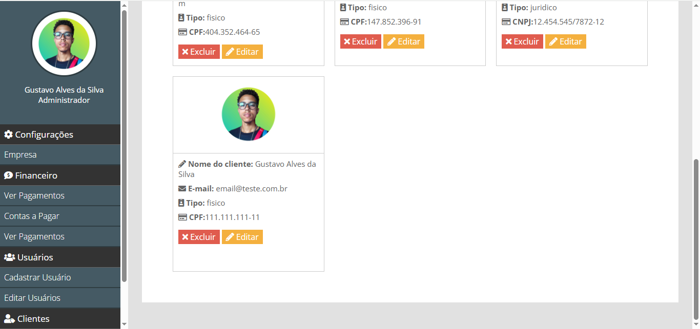

# Sistema de Gestão
> Sistema de Gestão de Empresas em PHP e MySQL

Este é um Sistema de Gestão para micro e pequenas empresas desenvolvido em PHP e MySQL. Baseado em um sistema básico de estoque desenvolvido durante as aulas do curso de Desenvolvimento Web da Danki Code, porém com uma série de melhorias e funcionaliaddes novas como:
- Fluxo de Caixa
- Contas a Pagar e Contas a Receber
- Plano de Contas
- Vencimentos 
- Competências
- Relatórios
- Vendas
- Produtos
- Ordens de Serviço
- Etc...

